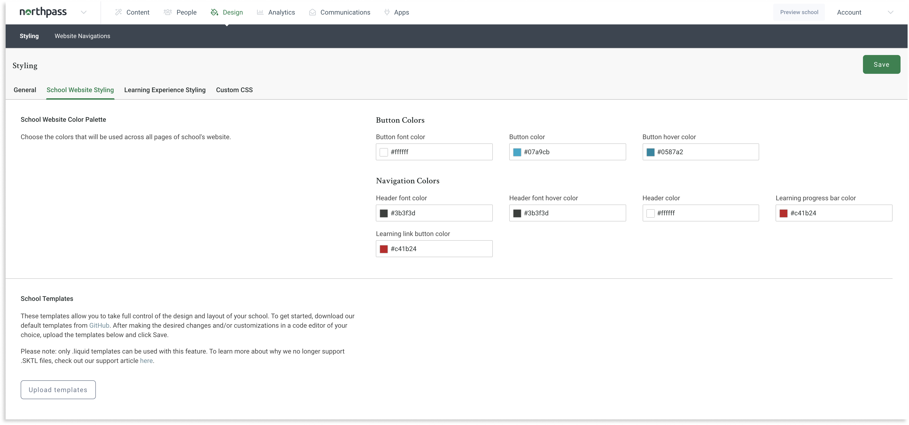

<h1 align="center">
  <br>
  <a href="https://www.northpass.com/">
    
  </a>
  <br>
  Northpass Templates
  <br>
</h1>
<br>

<div align="center">
  
  
</div>

<h4 align="center">Use this to customize the User Experience of your school</h4>
<br>

## Table of Contents
- [How Northpass templates work](#how-northpass-templates-work)
  - [General information](#general-information)
  - [Liquid](#liquid)
  - [Root and partial templates](#root-and-partial-templates)
  - [Important](#warning-important-warning)
- [Quick start](#quick-start)
- [Templates](#templates)
  - [/](https://github.com/SchoolKeep/schoolkeep-templates/tree/master#homepage-path)
  - [/learners/sign_in](https://github.com/SchoolKeep/schoolkeep-templates/tree/master#login)
  - [/my_dashboard](https://github.com/SchoolKeep/schoolkeep-templates/tree/master#my-dashboard)
  - [/learning_paths](https://github.com/SchoolKeep/schoolkeep-templates/tree/master#learning-paths)
  - [/learning_paths/:id](https://github.com/SchoolKeep/schoolkeep-templates/tree/master#learning-paths-id)
  - [/learning_paths/:id/cover](https://github.com/SchoolKeep/schoolkeep-templates/tree/master#learning-paths-id-cover)
  - [/courses/:id/cover](https://github.com/SchoolKeep/schoolkeep-templates/tree/master#course-id-cover)
  - [/learning_paths/:lp_id/courses/:c_id/cover](https://github.com/SchoolKeep/schoolkeep-templates/tree/master#learning_paths-lpid-courses-cid-cover)
  - [Learning Experience V3](https://github.com/SchoolKeep/schoolkeep-templates/tree/master#learning-experience-v3)
  - [Learning Experience V2](https://github.com/SchoolKeep/schoolkeep-templates/tree/master#learning-experience-v2)
  - [/account/edit](https://github.com/SchoolKeep/schoolkeep-templates/tree/master#account-edit)
  - [/training_events](https://github.com/SchoolKeep/schoolkeep-templates/tree/master#training-events)
  - [/training_sessions/:id](https://github.com/SchoolKeep/schoolkeep-templates/tree/master#training-session-id)
  - [/search](https://github.com/SchoolKeep/schoolkeep-templates/tree/master#search)
  - [/catalog](https://github.com/SchoolKeep/schoolkeep-templates/tree/master#catalog)
  - [/catalog_search](https://github.com/SchoolKeep/schoolkeep-templates/tree/master#catalog-search)
  - [/catalog/:id/:slug](https://github.com/SchoolKeep/schoolkeep-templates/tree/master#catalog-id-slug)
  - [/500](https://github.com/SchoolKeep/schoolkeep-templates/tree/master#server-error)
- [Variables](#variables)
  - [Global](#global)
  - [By template](#by-template)
  - [Definitions](#definitions)
- [FAQ](#faq-questionquestionquestion)


## [How Northpass templates work](#table-of-contents)
### [General information](#table-of-contents)
In this repository we give you the access to base templates, which should be the starting point for your customizations. All templates are in the `/templates` directory. You can edit them but you can't add your own.

### [Liquid](#table-of-contents)
At Northpass we use Liquid as a template language. [Liquid](https://shopify.github.io/liquid/) was created by Shopify and is used in production by dozens of companies around the world. We use it to load dynamic content on the school website. In individual templates you can use variables that download data directly from the Northpass platform. Thanks to this you have the opportunity to create a completely unique User Experience in your school.

We encourage you to read the [Liquid documentation](https://shopify.github.io/liquid/) to learn more about the syntax and possible use cases.

### [Root and partial templates](#table-of-contents)
The templates available in our application are divided into two types:
* **root templates**
* **partial templates**

**Root template** occurs only once for pages in the application for which we enable customizations, e.g. `my_content`, `course_index` or `course_details`.

**Partial templates** are smaller fragments that can be included in root templates, their name always begins with the prefix `_`.

Thanks to this division we are able for instance to customize a footer once and use it in all other templates.

This is the example of the root template and its partial templates:
```
course_index
    ├── _head
    ├── _header
    ├── _footer
    ├── _catalog_search_form
    ├── _course
```

### :warning: [Important](#table-of-contents) :warning:
Once you edit your templates we won’t support automatic updates with additional features that Northpass makes to the base templates. You will need to merge the changes into your templates directory. Additionally, we will not be able to support the look and feel of your website.

## [Quick start](#table-of-contents)
**1. Clone the repository**

```
git clone https://github.com/SchoolKeep/schoolkeep-templates.git
```

**2. Install text editor**

If you don't have any text editor installed, you should now choose one. Below is a list of a few that are very popular and you can certainly trust them.

VSCode             |  Atom          |  Sublime
:-------------------------:|:-------------------------:|:-------------------------:
<a href="https://code.visualstudio.com/"></a>  |  <a href="https://atom.io/"></a> |  <a href="https://www.sublimetext.com/"></a>

**3. Modify base templates**

Open the directory with the cloned repository in the text editor of your choice and you can get started! 🚀🚀🚀

**4. Upload modified templates to the Northpass application**

After you make changes to selected base templates, you should upload them to the application. Go to the `Design` tab in the administrator view and then to `School Website Styling`.

Click the `Upload Templates` button and add the templates you have chosen, then confirm the changes with the `Save` button.



## [Templates](#table-of-contents)

<table align="center" border="0">
    <tr>
        <td align="center">
		      <a name="homepage-path">
            <b>Path</b>
          </a>
        </td>
        <td align="center"><b>Available Templates</b></td>
    </tr>
    <tr>
        <td align="center">
        <b><code>/</code></b>
        <br>
        (available when Website and Catalog is active)
        </td>
        <td>
            <ul>
                <li><a href="https://github.com/SchoolKeep/schoolkeep-templates/blob/master/templates/homepage.html.liquid">homepage</a></li>
                <li><a href="https://github.com/SchoolKeep/schoolkeep-templates/blob/master/templates/_footer.html.liquid">_footer</a></li>
                <li><a href="https://github.com/SchoolKeep/schoolkeep-templates/blob/master/templates/_head.html.liquid">_head</a></li>
                <li><a href="https://github.com/SchoolKeep/schoolkeep-templates/blob/master/templates/_header.html.liquid">_header</a></li>
            </ul>
        </td>
    </tr>
	<tr>
		<td align="center" colspan="2">
		  <b>Screenshot</b>
		</td>
	</tr>
    <tr>
        <td colspan="2">
        
        </td>
    </tr>
</table>

[:arrow_up:](#table-of-contents)

<table align="center" border="0">
    <tr>
        <td align="center">
		      <a name="login">
            <b>Path</b>
          </a>
        </td>
        <td align="center"><b>Available Templates</b></td>
    </tr>
    <tr>
        <td align="center">
        <b><code>/learners/sign_in</code></b>
        </td>
        <td>
            <ul>
                <li><a href="https://github.com/SchoolKeep/schoolkeep-templates/blob/master/templates/login.html.liquid">login</a></li>
            </ul>
        </td>
    </tr>
	<tr>
		<td align="center" colspan="2">
		  <b>Screenshot</b>
		</td>
	</tr>
    <tr>
        <td colspan="2">
        
        </td>
    </tr>
</table>

❗️ Important note ❗️
The login page uses an HTML form to submit the learner's credentials. Please make sure you're not overwriting its internals:
- the `action` and `method` attributes on the `<form>` tag
- `form_authenticity_token` method inside the `<form>` tag
- the `name` attribute on the `<input>` tags

[:arrow_up:](#table-of-contents)

<table align="center" border="0">
    <tr>
        <td align="center">
		      <a name="my-dashboard">
            <b>Path</b>
          </a>
        </td>
        <td align="center"><b>Available Templates</b></td>
    </tr>
    <tr>
        <td align="center"><b><code>/my_dashboard</code></b></td>
        <td>
            <ul>
                <li><a href="https://github.com/SchoolKeep/schoolkeep-templates/blob/master/templates/my_content.html.liquid">my_content</a></li>
                <li><a href="https://github.com/SchoolKeep/schoolkeep-templates/blob/master/templates/_course.html.liquid">_course</a></li>
                <li><a href="https://github.com/SchoolKeep/schoolkeep-templates/blob/master/templates/_filters.html.liquid">_filters</a></li>
                <li><a href="https://github.com/SchoolKeep/schoolkeep-templates/blob/master/templates/_footer.html.liquid">_footer</a></li>
                <li><a href="https://github.com/SchoolKeep/schoolkeep-templates/blob/master/templates/_head.html.liquid">_head</a></li>
                <li><a href="https://github.com/SchoolKeep/schoolkeep-templates/blob/master/templates/_header.html.liquid">_header</a></li>
                <li><a href="https://github.com/SchoolKeep/schoolkeep-templates/blob/master/templates/_learning_path.html.liquid">_learning_path</a></li>
                <li><a href="https://github.com/SchoolKeep/schoolkeep-templates/blob/master/templates/_learning_path_filters.html.liquid">_learning_path_filters</a></li>
                <li><a href="https://github.com/SchoolKeep/schoolkeep-templates/blob/master/templates/_my_content_header.html.liquid">_my_content_header</a></li>
                <li><a href="https://github.com/SchoolKeep/schoolkeep-templates/blob/master/templates/_my_paths.html.liquid">_my_paths</a></li>
            </ul>
        </td>
    </tr>
	<tr>
		<td align="center" colspan="2">
		  <b>Screenshot</b>
		</td>
	</tr>
    <tr>
        <td colspan="2">
        
        </td>
    </tr>
</table>

[:arrow_up:](#table-of-contents)

<table align="center" border="0">
    <tr>
        <td align="center">
		      <a name="learning-paths">
            <b>Path</b>
          </a>
        </td>
        <td align="center"><b>Available Templates</b></td>
    </tr>
    <tr>
        <td align="center"><b><code>/learning_paths</code></b></td>
        <td>
            <ul>
                <li><a href="https://github.com/SchoolKeep/schoolkeep-templates/blob/master/templates/my_content.html.liquid">learning_paths_index</a></li>
                <li><a href="https://github.com/SchoolKeep/schoolkeep-templates/blob/master/templates/_footer.html.liquid">_footer</a></li>
                <li><a href="https://github.com/SchoolKeep/schoolkeep-templates/blob/master/templates/_head.html.liquid">_head</a></li>
                <li><a href="https://github.com/SchoolKeep/schoolkeep-templates/blob/master/templates/_header.html.liquid">_header</a></li>
                <li><a href="https://github.com/SchoolKeep/schoolkeep-templates/blob/master/templates/_learning_path.html.liquid">_learning_path</a></li>
            </ul>
        </td>
    </tr>
	<tr>
		<td align="center" colspan="2">
		  <b>Screenshot</b>
		</td>
	</tr>
    <tr>
        <td colspan="2">
        
        </td>
    </tr>
</table>

[:arrow_up:](#table-of-contents)

<table align="center" border="0">
    <tr>
        <td align="center">
		      <a name="learning-paths-id">
            <b>Path</b>
          </a>
        </td>
        <td align="center"><b>Available Templates</b></td>
    </tr>
    <tr>
        <td align="center">
        <b><code>/learning_paths/:id</code></b>
        <br>
        (available when Search + Discovery is active)
        </td>
        <td>
            <ul>
                <li><a href="https://github.com/SchoolKeep/schoolkeep-templates/blob/master/templates/learning_path_details.html.liquid">learning_path_details</a></li>
                <li><a href="https://github.com/SchoolKeep/schoolkeep-templates/blob/master/templates/_footer.html.liquid">_footer</a></li>
                <li><a href="https://github.com/SchoolKeep/schoolkeep-templates/blob/master/templates/_head.html.liquid">_head</a></li>
                <li><a href="https://github.com/SchoolKeep/schoolkeep-templates/blob/master/templates/_header.html.liquid">_header</a></li>
            </ul>
        </td>
    </tr>
	<tr>
		<td align="center" colspan="2">
		  <b>Screenshot</b>
		</td>
	</tr>
    <tr>
        <td colspan="2">
        
        </td>
    </tr>
</table>

[:arrow_up:](#table-of-contents)

<table align="center" border="0">
    <tr>
        <td align="center">
		      <a name="learning-paths-id-cover">
            <b>Path</b>
          </a>
        </td>
        <td align="center"><b>Available Templates</b></td>
    </tr>
    <tr>
        <td align="center"><b><code>/learning_paths/:id/cover</code></b></td>
        <td>
            <ul>
                <li><a href="https://github.com/SchoolKeep/schoolkeep-templates/blob/master/templates/custom_javascript_v3.html.liquid">custom_javascript_v3</a></li>
                <li><a href="https://github.com/SchoolKeep/schoolkeep-templates/blob/master/templates/learning_path_cover.html.liquid">learning_path_cover</a></li>
            </ul>
        </td>
    </tr>
	<tr>
		<td align="center" colspan="2">
		  <b>Screenshot</b>
		</td>
	</tr>
    <tr>
        <td colspan="2">
        
        </td>
    </tr>
</table>

[:arrow_up:](#table-of-contents)

<table align="center" border="0">
    <tr>
        <td align="center">
		      <a name="course-id-cover">
            <b>Path</b>
          </a>
          <a name="learning_paths-lpid-courses-cid-cover">
          </a>
        </td>
        <td align="center"><b>Available Templates</b></td>
    </tr>
    <tr>
        <td align="center">
        <b><code>/courses/:id/cover</code></b>
        <br>
        <b><code>/learning_paths/:lp_id/courses/:c_id/cover</code></b>
        </td>
        <td>
            <ul>
                <li><a href="https://github.com/SchoolKeep/schoolkeep-templates/blob/master/templates/course_cover.html.liquid">course_cover</a></li>
                <li><a href="https://github.com/SchoolKeep/schoolkeep-templates/blob/master/templates/custom_javascript_v3.html.liquid">custom_javascript_v3</a> (when on Learning Experience V3)</li>
                <li><a href="https://github.com/SchoolKeep/schoolkeep-templates/blob/master/templates/custom_javascript_v2.html.liquid">custom_javascript_v2</a> (when on Learning Experience V2)</li>
            </ul>
        </td>
    </tr>
	<tr>
		<td align="center" colspan="2">
		  <b>Screenshot</b>
		</td>
	</tr>
    <tr>
        <td colspan="2">
        
        </td>
    </tr>
</table>

[:arrow_up:](#table-of-contents)

<table align="center" border="0">
    <tr>
        <td align="center">
		      <a name="learning-experience-v3">
            <b>Path</b>
          </a>
        </td>
        <td align="center"><b>Available Templates</b></td>
    </tr>
    <tr>
        <td align="center"><b><code>Learning Experience V3</code></b></td>
        <td>
            <ul>
                <li><a href="https://github.com/SchoolKeep/schoolkeep-templates/blob/master/templates/custom_javascript_v3.html.liquid">custom_javascript_v3</a></li>
            </ul>
        </td>
    </tr>
	<tr>
		<td align="center" colspan="2">
		  <b>Screenshot</b>
		</td>
	</tr>
    <tr>
        <td colspan="2">
        
        </td>
    </tr>
</table>

[:arrow_up:](#table-of-contents)

<table align="center" border="0">
    <tr>
        <td align="center">
		      <a name="learning-experience-v2">
            <b>Path</b>
          </a>
        </td>
        <td align="center"><b>Available Templates</b></td>
    </tr>
    <tr>
        <td align="center"><b><code>Learning Experience V2</code></b></td>
        <td>
            <ul>
                <li><a href="https://github.com/SchoolKeep/schoolkeep-templates/blob/master/templates/custom_javascript_v2.html.liquid">custom_javascript_v2</a></li>
            </ul>
        </td>
    </tr>
	<tr>
		<td align="center" colspan="2">
		  <b>Screenshot</b>
		</td>
	</tr>
    <tr>
        <td colspan="2">
        
        </td>
    </tr>
</table>

[:arrow_up:](#table-of-contents)

<table align="center" border="0">
    <tr>
        <td align="center">
		      <a name="account-edit">
            <b>Path</b>
          </a>
        </td>
        <td align="center"><b>Available Templates</b></td>
    </tr>
    <tr>
        <td align="center"><b><code>/account/edit</code></b></td>
        <td>
            <ul>
                <li><a href="https://github.com/SchoolKeep/schoolkeep-templates/blob/master/templates/_footer.html.liquid">_footer</a></li>
                <li><a href="https://github.com/SchoolKeep/schoolkeep-templates/blob/master/templates/_head.html.liquid">_head</a></li>
                <li><a href="https://github.com/SchoolKeep/schoolkeep-templates/blob/master/templates/_header.html.liquid">_header</a></li>
            </ul>
        </td>
    </tr>
	<tr>
		<td align="center" colspan="2">
		  <b>Screenshot</b>
		</td>
	</tr>
    <tr>
        <td colspan="2">
            
        </td>
    </tr>
</table>

[:arrow_up:](#table-of-contents)

<table align="center" border="0">
    <tr>
        <td align="center">
		      <a name="training-events">
            <b>Path</b>
          </a>
        </td>
        <td align="center"><b>Available Templates</b></td>
    </tr>
    <tr>
        <td align="center">
        <b><code>/training_events</code></b>
        <br>
        (available when Instructor-Led Training is active)
        </td>
        <td>
            <ul>
                <li><a href="https://github.com/SchoolKeep/schoolkeep-templates/blob/master/templates/discover_events.html.liquid">discover_events</a></li>
                <li><a href="https://github.com/SchoolKeep/schoolkeep-templates/blob/master/templates/_footer.html.liquid">_footer</a></li>
                <li><a href="https://github.com/SchoolKeep/schoolkeep-templates/blob/master/templates/_head.html.liquid">_head</a></li>
                <li><a href="https://github.com/SchoolKeep/schoolkeep-templates/blob/master/templates/_header.html.liquid">_header</a></li>
                <li><a href="https://github.com/SchoolKeep/schoolkeep-templates/blob/master/templates/_training_session.html.liquid">_training_session</a></li>
                <li><a href="https://github.com/SchoolKeep/schoolkeep-templates/blob/master/templates/_training_event.html.liquid">_training_event</a></li>
            </ul>
        </td>
    </tr>
	<tr>
		<td align="center" colspan="2">
		  <b>Screenshot</b>
		</td>
	</tr>
    <tr>
        <td colspan="2">
        
        </td>
    </tr>
</table>

[:arrow_up:](#table-of-contents)

<table align="center" border="0">
    <tr>
        <td align="center">
		      <a name="training-session-id">
            <b>Path</b>
          </a>
        </td>
        <td align="center"><b>Available Templates</b></td>
    </tr>
    <tr>
        <td align="center">
        <b><code>/training_sessions/:id</code></b>
        <br>
        (available when Instructor-Led Training is active)
        </td>
        <td>
            <ul>
                <li><a href="https://github.com/SchoolKeep/schoolkeep-templates/blob/master/templates/training_session_show.html.liquid">training_session_show</a></li>
                <li><a href="https://github.com/SchoolKeep/schoolkeep-templates/blob/master/templates/_footer.html.liquid">_footer</a></li>
                <li><a href="https://github.com/SchoolKeep/schoolkeep-templates/blob/master/templates/_head.html.liquid">_head</a></li>
                <li><a href="https://github.com/SchoolKeep/schoolkeep-templates/blob/master/templates/_header.html.liquid">_header</a></li>
            </ul>
        </td>
    </tr>
	<tr>
		<td align="center" colspan="2">
		  <b>Screenshot</b>
		</td>
	</tr>
    <tr>
        <td colspan="2">
        
        </td>
    </tr>
</table>

[:arrow_up:](#table-of-contents)

<table align="center" border="0">
    <tr>
        <td align="center">
		      <a name="search">
            <b>Path</b>
          </a>
        </td>
        <td align="center"><b>Available Templates</b></td>
    </tr>
    <tr>
        <td align="center">
        <b><code>/search</code></b>
        <br>
        (available when Search + Discovery is active)
        </td>
        <td>
            <ul>
                <li><a href="https://github.com/SchoolKeep/schoolkeep-templates/blob/master/templates/_filters.html.liquid">_filters</a></li>
                <li><a href="https://github.com/SchoolKeep/schoolkeep-templates/blob/master/templates/_footer.html.liquid">_footer</a></li>
                <li><a href="https://github.com/SchoolKeep/schoolkeep-templates/blob/master/templates/_head.html.liquid">_head</a></li>
                <li><a href="https://github.com/SchoolKeep/schoolkeep-templates/blob/master/templates/_header.html.liquid">_header</a></li>
                <li><a href="https://github.com/SchoolKeep/schoolkeep-templates/blob/master/templates/_search_form.html.liquid">_search_form</a></li>
            </ul>
        </td>
    </tr>
	<tr>
		<td align="center" colspan="2">
		  <b>Screenshot</b>
		</td>
	</tr>
    <tr>
        <td colspan="2">
        
        </td>
    </tr>
</table>

[:arrow_up:](#table-of-contents)

<table align="center" border="0">
    <tr>
        <td align="center">
		      <a name="catalog">
            <b>Path</b>
          </a>
        </td>
        <td align="center"><b>Available Templates</b></td>
    </tr>
    <tr>
        <td align="center">
        <b><code>/catalog</code></b>
        <br>
        (available when Website and Catalog is active)
        </td>
        <td>
            <ul>
                <li><a href="https://github.com/SchoolKeep/schoolkeep-templates/blob/master/templates/course_index.html.liquid">course_index</a></li>
                <li><a href="https://github.com/SchoolKeep/schoolkeep-templates/blob/master/templates/_footer.html.liquid">_footer</a></li>
                <li><a href="https://github.com/SchoolKeep/schoolkeep-templates/blob/master/templates/_head.html.liquid">_head</a></li>
                <li><a href="https://github.com/SchoolKeep/schoolkeep-templates/blob/master/templates/_header.html.liquid">_header</a></li>
                <li><a href="https://github.com/SchoolKeep/schoolkeep-templates/blob/master/templates/_catalog_search_form.html.liquid">_catalog_search_form</a></li>
                <li><a href="https://github.com/SchoolKeep/schoolkeep-templates/blob/master/templates/_course.html.liquid">_course</a></li>
            </ul>
        </td>
    </tr>
	<tr>
		<td align="center" colspan="2">
		  <b>Screenshot</b>
		</td>
	</tr>
    <tr>
        <td colspan="2">
        
        </td>
    </tr>
</table>

[:arrow_up:](#table-of-contents)

<table align="center" border="0">
    <tr>
        <td align="center">
		      <a name="catalog-search">
            <b>Path</b>
          </a>
        </td>
        <td align="center"><b>Available Templates</b></td>
    </tr>
    <tr>
        <td align="center">
        <b><code>/catalog_search</code></b>
        <br>
        (available when Search + Discovery is active)
        </td>
        <td>
            <ul>
                <li><a href="https://github.com/SchoolKeep/schoolkeep-templates/blob/master/templates/_footer.html.liquid">_footer</a></li>
                <li><a href="https://github.com/SchoolKeep/schoolkeep-templates/blob/master/templates/_head.html.liquid">_head</a></li>
                <li><a href="https://github.com/SchoolKeep/schoolkeep-templates/blob/master/templates/_header.html.liquid">_header</a></li>
                <li><a href="https://github.com/SchoolKeep/schoolkeep-templates/blob/master/templates/_catalog_search_form.html.liquid">_catalog_search_form</a></li>
                <li><a href="https://github.com/SchoolKeep/schoolkeep-templates/blob/master/templates/_catalog_filters.html.liquid">_catalog_filters</a></li>
            </ul>
        </td>
    </tr>
	<tr>
		<td align="center" colspan="2">
		  <b>Screenshot</b>
		</td>
	</tr>
    <tr>
        <td colspan="2">
        
        </td>
    </tr>
</table>

[:arrow_up:](#table-of-contents)

<table align="center" border="0">
    <tr>
        <td align="center">
		      <a name="catalog-id-slug">
            <b>Path</b>
          </a>
        </td>
        <td align="center"><b>Available Templates</b></td>
    </tr>
    <tr>
        <td align="center">
        <b><code>/catalog/:id/:slug</code></b>
        <br>
        (available when Website and Catalog is active)
        </td>
        <td>
            <ul>
                <li><a href="https://github.com/SchoolKeep/schoolkeep-templates/blob/master/templates/course_details.html.liquid">course_details</a></li>
                <li><a href="https://github.com/SchoolKeep/schoolkeep-templates/blob/master/templates/_footer.html.liquid">_footer</a></li>
                <li><a href="https://github.com/SchoolKeep/schoolkeep-templates/blob/master/templates/_head.html.liquid">_head</a></li>
                <li><a href="https://github.com/SchoolKeep/schoolkeep-templates/blob/master/templates/_header.html.liquid">_header</a></li>
                <li><a href="https://github.com/SchoolKeep/schoolkeep-templates/blob/master/templates/_catalog_search_form.html.liquid">_catalog_search_form</a></li>
            </ul>
        </td>
    </tr>
	<tr>
		<td align="center" colspan="2">
		  <b>Screenshot</b>
		</td>
	</tr>
    <tr>
        <td colspan="2">
        
        </td>
    </tr>
</table>

[:arrow_up:](#table-of-contents)

<table align="center" border="0">
    <tr>
        <td align="center">
		      <a name="server-error">
            <b>Path</b>
          </a>
        </td>
        <td align="center"><b>Available Templates</b></td>
    </tr>
    <tr>
        <td align="center">
        <b><code>/500</code></b>
        </td>
        <td>
            <ul>
                <li><a href="https://github.com/SchoolKeep/schoolkeep-templates/blob/master/templates/server_error.html.liquid">server_error</a></li>
                <li><a href="https://github.com/SchoolKeep/schoolkeep-templates/blob/master/templates/_footer.html.liquid">_footer</a></li>
                <li><a href="https://github.com/SchoolKeep/schoolkeep-templates/blob/master/templates/_head.html.liquid">_head</a></li>
                <li><a href="https://github.com/SchoolKeep/schoolkeep-templates/blob/master/templates/_header.html.liquid">_header</a></li>
            </ul>
        </td>
    </tr>
	<tr>
		<td align="center" colspan="2">
		  <b>Screenshot</b>
		</td>
	</tr>
    <tr>
        <td colspan="2">
        
        </td>
    </tr>
</table>

[:arrow_up:](#table-of-contents)

## [Variables](#table-of-contents)
Variables are one of the most useful functionalities when customizing the look of your school. Northpass provides a number of different variables in the available templates so that you can modify your school's appearance in a dynamic way.

### [Global](#table-of-contents)
The following variables are exposed globally and can be used in all the templates:

* <a href="https://github.com/SchoolKeep/schoolkeep-templates/tree/master#header_navigations">header_navigations</a>
* <a href="https://github.com/SchoolKeep/schoolkeep-templates/tree/master#footer_navigations">footer_navigations</a>
* <a href="https://github.com/SchoolKeep/schoolkeep-templates/tree/master#my_content">my_content</a>
* <a href="https://github.com/SchoolKeep/schoolkeep-templates/tree/master#learning_paths">learning_paths</a>
* <a href="https://github.com/SchoolKeep/schoolkeep-templates/tree/master#website_footer">website_footer</a>
* <a href="https://github.com/SchoolKeep/schoolkeep-templates/tree/master#discover_events">discover_events</a>
* <a href="https://github.com/SchoolKeep/schoolkeep-templates/tree/master#training_events">training_events</a>


### [By template](#table-of-contents)
Below is a table with available variables broken down into individual templates. Unfortunately at the moment not all variables are available from any template so keep these restrictions in mind.

<table border="0">
<tr>
    <th>Template</th>
    <th>Variables</th>
</tr>
<tr>
    <td>
    <a href="https://github.com/SchoolKeep/schoolkeep-templates/blob/master/templates/learning_path_cover.html.liquid">learning_path_cover</a>
    <br>
    <a href="https://github.com/SchoolKeep/schoolkeep-templates/blob/master/templates/learning_path_details.html.liquid">learning_path_details</a>
    </td>
<td>
	<ul>
	<li><a href="https://github.com/SchoolKeep/schoolkeep-templates/tree/master#learning_path">learning_path</a></li>
	</ul>
</td></tr>
<tr><td><a href="https://github.com/SchoolKeep/schoolkeep-templates/blob/master/templates/course_index.html.liquid">course_index</a></td>
<td>
	<ul>
	<li><a href="https://github.com/SchoolKeep/schoolkeep-templates/tree/master#courses">courses</a></li>
	</ul>
</td></tr>
<tr>
    <td>
    <a href="https://github.com/SchoolKeep/schoolkeep-templates/blob/master/templates/course_cover.html.liquid">course_cover</a>
    <br>
    <a href="https://github.com/SchoolKeep/schoolkeep-templates/blob/master/templates/course_details.html.liquid">course_details</a>
    </td>
<td>
	<ul>
	<li><a href="https://github.com/SchoolKeep/schoolkeep-templates/tree/master#course">course</a></li>
	</ul>
</td></tr>
<tr><td><a href="https://github.com/SchoolKeep/schoolkeep-templates/blob/master/templates/homepage.html.liquid">homepage</a></td>
<td>
	<ul>
	<li><a href="https://github.com/SchoolKeep/schoolkeep-templates/tree/master#homepage">homepage</a></li>
	</ul>
</td></tr>
<tr>
    <td>
    <a href="https://github.com/SchoolKeep/schoolkeep-templates/blob/master/templates/_search_form.html.liquid">_search_form</a>
    <br>
    <a href="https://github.com/SchoolKeep/schoolkeep-templates/blob/master/templates/_catalog_search_form.html.liquid">_catalog_search_form</a>
    </td>
<td>
	<ul>
	<li><a href="https://github.com/SchoolKeep/schoolkeep-templates/tree/master#search_result">search_result</a></li>
	</ul>
</td></tr>
<tr><td><a href="https://github.com/SchoolKeep/schoolkeep-templates/blob/master/templates/training_session_show.html.liquid">training_session_show</a></td>
<td>
	<ul>
	<li><a href="https://github.com/SchoolKeep/schoolkeep-templates/tree/master#training_session">training_session</a></li>
	</ul>
</td></tr>
<tr><td><a href="https://github.com/SchoolKeep/schoolkeep-templates/blob/master/templates/_training_session.html.liquid">_training_session</a></td>
<td>
	<ul>
	<li>session</li>
	</ul>
</td></tr>
<tr><td><a href="https://github.com/SchoolKeep/schoolkeep-templates/blob/master/templates/_training_event.html.liquid">_training_event</a></td>
<td>
	<ul>
	<li><a href="https://github.com/SchoolKeep/schoolkeep-templates/tree/master#training_event">training_event</a></li>
	</ul>
</td></tr>
</table>

### [Definitions](#table-of-contents)
#### Arrays
Some of the available variables in the templates are **Arrays**, so the following methods are available for them:

* `any?`
* `each`
* `empty?`
* `size`

For more please visit: https://shopify.github.io/liquid/basics/introduction/.

[:arrow_up:](#table-of-contents) [:arrow_up_small:](#by-template)

#### `color_palette`

**Methods:**
* `button_color`
* `button_font_color`
* `button_hover_color`
* `color_palette`
* `header_color`
* `header_font_color`
* `header_font_hover_color`
* `learning_header_color`
* `learning_header_font_color`
* `learning_header_font_hover_color`
* `learning_link_button_color`
* `learning_progress_bar_color`

[:arrow_up:](#table-of-contents) [:arrow_up_small:](#by-template)

#### `current_person`

**Methods:**
* `email`
* `enrolled_in_course?`
* `first_name`
* `id`
* `sso_uid`

**Example:**

:warning: It takes learning path from current context :warning:
```

     // course variable is implicitly used here
    

```
---
* `enrolled_in_learning_path?`

**Example:**

:warning: It takes learning path from current context :warning:
```

     // learning_path variable is implicitly used here
    

```
---
* `filterable_catalog_categories`
* `filterable_categories`
* `filterable_learning_path_categories`
* `id`
* `my_content_label`
* `name`
* `signed_in?`
* `upcoming_registered_events`

[:arrow_up:](#table-of-contents) [:arrow_up_small:](#by-template)

#### `current_school`

**Methods:**
* `apps`
* `disable_social_share?`
* `filterable_categories`
* `filtering_enabled?`
* `has_custom_styles?`
* `id`
* `learning_paths_enabled?`
* `logo_navigation_url`
* `logo_url`
* `my_content_label`
* `name`
* `public`
* `search_enabled?`
* `show_powered_by_school_keep?`
* `sso_enabled?`
* `uuid`

[:arrow_up:](#table-of-contents) [:arrow_up_small:](#by-template)

#### `custom_templates`

**Methods:**
* `any?`
* `each`

[:arrow_up:](#table-of-contents) [:arrow_up_small:](#by-template)

#### `custom_template`
Available when using `each` method on [custom_templates](#custom_templates).

**Methods:**
* `fingerprint`
* `name`

[:arrow_up:](#table-of-contents) [:arrow_up_small:](#by-template)

#### `my_content`

**Methods:**
* `courses`
* `empty_learning_paths`
* `headline`
* `learning_paths?`
* `learning_paths_headline`
* `learning_paths_subheadline`
* `learning_paths`
* `subheadline`

[:arrow_up:](#table-of-contents) [:arrow_up_small:](#by-template)

#### `routes`

**Methods:**
* `color_scheme_path`
* `custom_styles_path`
* `log_in_path`
* `log_out_path`
* `my_content_path`
* `my_profile_path`
* `school_website_catalog_path`
* `school_website_catalog_search_path`
* `school_website_search_path`
* `schoolkeep_v3_styles_url`
* `sign_up_path`
* `url_helpers`

[:arrow_up:](#table-of-contents) [:arrow_up_small:](#by-template)

#### `courses`

**Methods:**
* `any?`
* `each`

[:arrow_up:](#table-of-contents) [:arrow_up_small:](#by-template)

#### `course`
Available also when using `each` method on [courses](#courses).

**Methods:**
* `about_label`
* `buy_label`
* `course_attempts_path`
* `course_category_names`
* `cover_path`
* `details_path`
* `discover_events_path`
* `enrollment_url`
* `featured_image_url`
* `formatted_price`
* `forum_path`
* `full_description`
* `go_to_label`
* `has_forum?`
* `has_outline`
* `id`
* `instructor_names`
* `instructors_title`
* `instructors`
* `learner_can_retake?`
* `list_image_url`
* `name`
* `new_order_path`
* `outline_label`
* `outline_path`
* `payment_required?`
* `progress_bar`
* `progress_text`
* `progress_title`
* `progress`
* `promo_video_embed`
* `published_sections`
* `register_for_events`
* `retake_course`
* `ribbon`
* `short_description`
* `show_events?`
* `social_links`
* `start_or_continue`
* `superscirpt`
* `view_label`

[:arrow_up:](#table-of-contents) [:arrow_up_small:](#by-template)

#### `footer_navigations`

**Methods:**
* `any?`
* `each`

[:arrow_up:](#table-of-contents) [:arrow_up_small:](#by-template)

#### `header_navigations`

**Methods:**
* `any?`
* `each`

[:arrow_up:](#table-of-contents) [:arrow_up_small:](#by-template)

#### `website_navigation`
Available when using `each` method on [header_navigations](#header_navigations) or [footer_navigations](#footer_navigations).

**Methods:**
* `external?`
* `name`
* `path`

[:arrow_up:](#table-of-contents) [:arrow_up_small:](#by-template)

#### `website_footer`

**Methods:**
* `school_customer_service_email`
* `show_customer_service_email?`
* `show_navigation_links?`
* `show_social_media_links?`
* `social_media_links`

[:arrow_up:](#table-of-contents) [:arrow_up_small:](#by-template)


#### `learning_paths`

**Methods:**
* `any?`
* `each`

[:arrow_up:](#table-of-contents) [:arrow_up_small:](#by-template)

#### `learning_path`
Available also when using `each` method on [learning_paths](#learning_paths)

**Methods:**
* `about_label`
* `cover_path`
* `current_person_learning_path_item`
* `description`
* `details_path`
* `enrollment_url`
* `featured_image_url`
* `first_uncompleted_cover_path`
* `go_to_label`
* `has_instructors?`
* `has_progress?`
* `id`
* `instructor_names`
* `instructors_title`
* `instructors`
* `items`
* `learning_path_category_names`
* `list_image_url`
* `name`
* `outline_label`
* `progress_bar`
* `progress_text`
* `view_label`

[:arrow_up:](#table-of-contents) [:arrow_up_small:](#by-template)

#### `instructor`
Available when using `each` method on [learning_path](#learning_path) `.instructors`.

**Methods:**
* `bio`
* `image_url`
* `name`
* `title`

[:arrow_up:](#table-of-contents) [:arrow_up_small:](#by-template)

#### `person_learning_path_item`
Available when using `each` method on [learning_path](#learning_path) `.items`.

**Methods:**
* `completed?`
* `cover_path`
* `locked?`
* `name`
* `optional?`
* `progress_icon`
* `traning_event`
* `type_icon`

[:arrow_up:](#table-of-contents) [:arrow_up_small:](#by-template)

#### `section`
Available when using `each` method on [course](#course) `.published_sections`.

**Methods:**
* `activities`
* `id`
* `name`
* `published_at`
* `will_be_published?`

[:arrow_up:](#table-of-contents) [:arrow_up_small:](#by-template)

#### `activity`
Available when using `each` method on [section](#section) `.activities`.

**Methods:**
* `completed?`
* `id`
* `list_class`
* `locked?`
* `milestone?`
* `path`
* `title`

[:arrow_up:](#table-of-contents) [:arrow_up_small:](#by-template)


#### `search_result`

**Methods:**
* `count`

[:arrow_up:](#table-of-contents) [:arrow_up_small:](#by-template)

#### `homepage`

**Methods:**
* `artwork_url`
* `featured_courses_headline`
* `featured_courses_subheadline`
* `headline`
* `published_featured_courses`
* `subheadline`

[:arrow_up:](#table-of-contents) [:arrow_up_small:](#by-template)

#### `training_events`

The list of training events. The object is type of Array and [these methods](#arrays) can be used with it.

Each of them has access to methods from [training_event](#training_event).

[:arrow_up:](#table-of-contents) [:arrow_up_small:](#by-template)

#### `training_event`

**Methods:**
* `id` - unique identifier of training event
* `sessions` - list of training sessions. Each of them has access to methods from [training_session](#training_session).
* `title`
* `type` - one of: `In person`, `Online`

[:arrow_up:](#table-of-contents) [:arrow_up_small:](#by-template)

#### `training_session`

**Methods:**
* `description`
* `event_type_title`
* `id`
* `instructor_assigned?`
* `instructor_image_url`
* `instructor_name`
* `instructor_title`
* `location`
* `other_sessions_count`
* `other_sessions`
* `register_url`
* `registration_actions`
* `self_url`
* `session_day`
* `session_month`
* `session_name`
* `session_time`
* `session_url`
* `starts_at`
* `title`
* `training_session`
* `unregister_url`

[:arrow_up:](#table-of-contents) [:arrow_up_small:](#by-template)

#### `discover_events`

**Methods:**
* `filter_options`
* `filter`

[:arrow_up:](#table-of-contents) [:arrow_up_small:](#by-template)

## [FAQ](#table-of-contents) :question::question::question:

**1. What pages don't have templates?**

Any page not listed in [Templates](#templates) part.

**2. What objects are available (example: `_course.html.liquid`) on each page? What do they do?**

We have a list of variables available to every template [here](#by-template). Additionally [in the same section](#by-template) we have templates that have more variables you can access. Please note that most of the templates starting with `_` are called **partials** (they are used inside another template) and have exactly the same variables as their **root template**.

**3. How can we upload templates programmatically?**

There is an api endpoint:

    POST api.northpass.com/v1/custom_templates
    data: {
            custom_template: {
              name: name,
              body: body,
              engine: "liquid"
            }
          }

**4. What is the "homepage" template?**

[Homepage template](https://github.com/SchoolKeep/schoolkeep-templates/tree/master#homepage-path) is used on the `/` (no path, plain domain) url when Website & Catalog app is active.

**5. How do I get all learner's courses?**

Probably the only way now is to use `my_content.courses` in the [my_content template](https://github.com/SchoolKeep/schoolkeep-templates/blob/master/templates/my_content.html.liquid).

**6. Can I retrieve a specific course?**

Only way would be to iterate over [courses](#courses) and then using some logic to use only specific course.

    
       
         // do something with specific course
    	 
    


**7. What are all the custom_javascript files?**

`custom_javascript_v[LX version]` is used dependent on the current account LX version. Other custom_javascript files are remains of old code and are unused.

**8. Is there a universal template we can use that *isn't* `_footer.html.liquid`?**

Looking at [Templates](#templates) there're also `_head` and `_header` templates but `_footer` is the last one rendered in HTML which is the best place for javascript workarounds.
